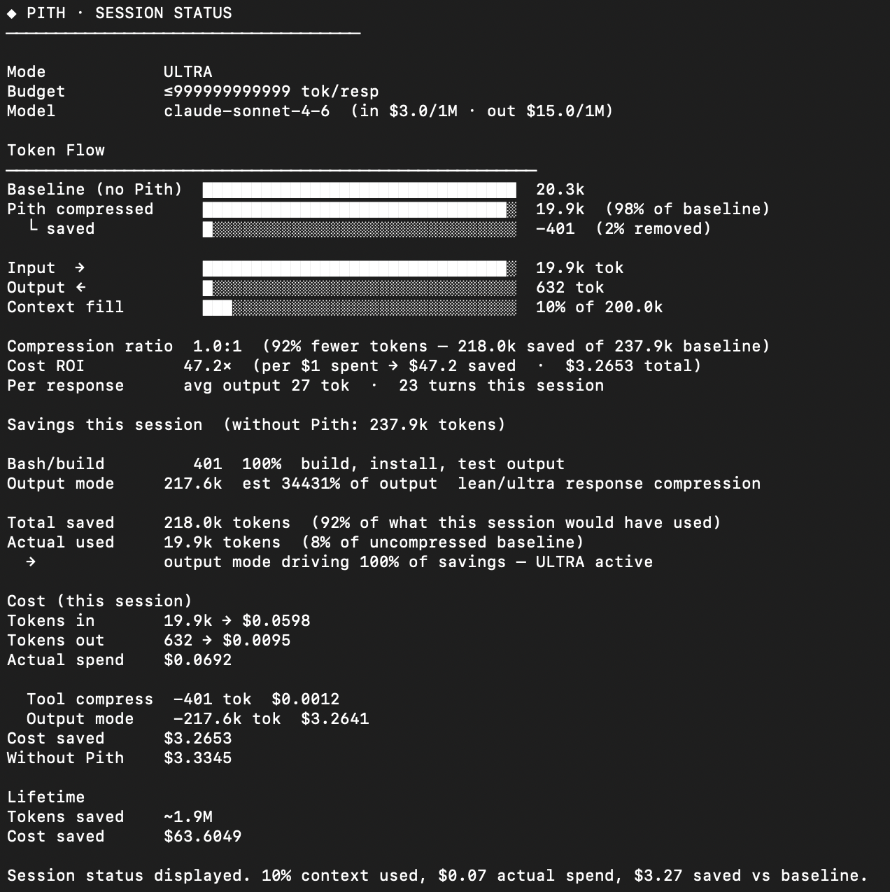

# Pith

[](https://github.com/abhisekjha/pith/stargazers)

> **Status: stable — not actively adding features.** Bug fixes welcome via issues.

Token compression hooks for Claude Code. Install once, works in every session, zero config.

```bash
bash <(curl -s https://raw.githubusercontent.com/usqr/pith/main/install.sh)
```

---

## How it works

Four hooks attach to Claude Code's lifecycle. Every session, every project, automatically.

- **`PostToolUse`** — compresses file reads, bash output, and grep results before they hit context
- **`UserPromptSubmit`** — runs `/pith` commands, enforces token ceiling if set
- **`SessionStart`** — restores compression mode, injects cache-locked rules
- **`Stop`** — records token usage for `status` and `report`

The `PostToolUse` hook is where most savings happen — file reads alone account for 30–50% of context in a typical coding session.

| Tool output | What happens | Typical saving |
|-------------|-------------|----------------|
| File reads | skeleton only — imports, signatures, types | −88% per read |
| Bash / build | errors + summary, verbose logs discarded | −91% per run |
| Grep results | capped at 25 matches | prevents runaway searches |
| Large payloads | offloaded to `~/.pith/tmp/`, pointer left in context | prevents bloat |

---

## Core features

### 1 — Auto compression (zero config)

Runs automatically. No commands needed. Every file read, bash run, and grep gets compressed on the way back to Claude.

Real session numbers:
```
Read large-service.ts  →  1,800 tokens baseline  →  210 tokens compressed  (−88%)
npm install output     →    940 tokens baseline  →   80 tokens compressed  (−91%)
```

### 2 — Output modes

Control how Claude writes back to you.

```
/pith           → lean: drop filler, short synonyms, fragments OK
/pith ultra     → maximum: abbreviate, arrows, tables
/pith precise   → tight but full sentences
/pith off       → disable output compression
```

Auto-escalation kicks in as context fills — no manual switching needed:
```
50% fill → LEAN
70% fill → ULTRA
85% fill → dynamic token ceiling
```

### 3 — Token status

```
/pith status    → ASCII flow chart — baseline vs compressed vs output + plain-English savings
/pith report    → interactive HTML dashboard (auto-refreshes every 30s)
```



### 4 — Smart file focus

Load only the sections of a file relevant to your current question. Saves re-reading large files.

```
/focus src/services/auth.ts
```

Returns the 5 most relevant sections with a structure overview. Works on any file type.

### 5 — Symbol extraction

Pull exact function or class definitions without reading the whole file.

```
/pith symbol src/auth.ts handleLogin      → exact 30–50 lines (~95% vs full file)
/pith symbol --list src/auth.ts           → all symbols with line numbers
```

---

## Install

```bash
bash <(curl -s https://raw.githubusercontent.com/usqr/pith/main/install.sh)
```

Or from source:
```bash
git clone https://github.com/usqr/pith
bash pith/install.sh
```

Hooks install globally into `~/.claude/hooks/`. Active in every session from that point on.

**Update:**
```
/pith update    → git pull + re-sync hooks, commands, settings
```

**Uninstall:**
```
/pith uninstall
```

---

## Advanced features

All present and functional. Not the daily workflow, but there when you need them.

| Feature | Command | What it does |
|---------|---------|-------------|
| Project wiki | `/pith ingest <file>` | Extract entities, claims, decisions into `wiki/` |
| URL ingestion | `/pith ingest --url <url>` | Fetch and ingest a web page |
| Wiki query | `/pith wiki "question"` | Search wiki with citations |
| Wiki synthesis | `/pith compile` | Re-synthesize all sources into wiki pages |
| Wiki lint | `/pith lint` | Find contradictions, gaps, missing pages |
| Knowledge graph | `/pith-graph` | Visual graph of wiki entities in browser |
| jCodeMunch | auto on code files | Structure-aware ingest — skeleton not full source |
| Token ceiling | `/budget 150` | Hard token cap, enforced every prompt |
| Structured formats | `/pith debug` / `review` / `arch` / `plan` / `commit` | Output templates |
| Tour | `/pith tour` | 7-step interactive walkthrough |
| Health check | `/pith health` | Diagnose hook and config issues |
| Evals | `python evals/harness.py` | Run compression benchmark (needs API key) |

---

## Honest numbers

Estimates against real usage — not against "no system prompt."

```
Before Pith:  Read large-service.ts → 1,800 tokens
After Pith:   Read large-service.ts →   210 tokens   (−88%)

Before Pith:  npm install output    →   940 tokens
After Pith:   errors + summary      →    80 tokens   (−91%)
```

Session from real use:
- 19.9k input tokens (237.9k baseline without Pith)
- 218k tokens saved — 92% compression ratio
- $0.07 actual vs $3.33 without Pith — **47× cost ROI**

See [BENCHMARKS.md](BENCHMARKS.md) for methodology and raw numbers.

---

## Multi-model pricing

Pith detects the model automatically and applies correct rates. No config needed.

| Model | Input ($/MTok) | Output ($/MTok) |
|-------|---------------|----------------|
| Claude Opus 4.7 / 4.6 / 4.5 | $5.00 | $25.00 |
| Claude Sonnet 4.6 / 4.5 / 4 | $3.00 | $15.00 |
| Claude Haiku 4.5 | $1.00 | $5.00 |
| Claude Haiku 3.5 | $0.80 | $4.00 |

Falls back to Sonnet 4.6 rates if model can't be determined.

---

## Star History

[](https://star-history.com/#abhisekjha/pith&Date)

---

## License

MIT
